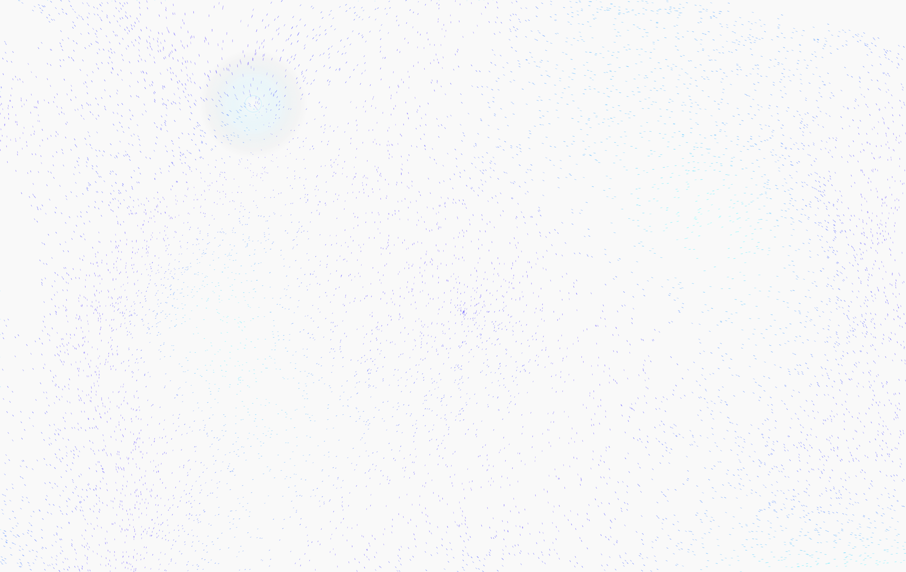

# Current

Interactive Flutter generative art for the web. Particles move through a
Perlin-noise flow field, curl toward the current mouse, click, or touch
position, and can be tuned/exported from the live page.


## Export example



## Run locally

```sh
flutter pub get
flutter run -d chrome
```

Move the cursor, click, or drag to pull the field around the pointer. Use the
top controls to tune density, trails, cursor pull, and palette. Click `PNG` to
save the current canvas, or `Reseed` to regenerate the particles.

## Build static HTML

For a local web build:

```sh
flutter build web --release
```

For GitHub Pages on this repository:

```sh
flutter build web --release --base-href /Current/
```

The static site is generated in `build/web`.

## Deploy to GitHub Pages

This repo includes a GitHub Actions workflow at
`.github/workflows/deploy-pages.yml`. Push to `main`, then in GitHub set
`Settings > Pages > Build and deployment > Source` to `GitHub Actions`.
